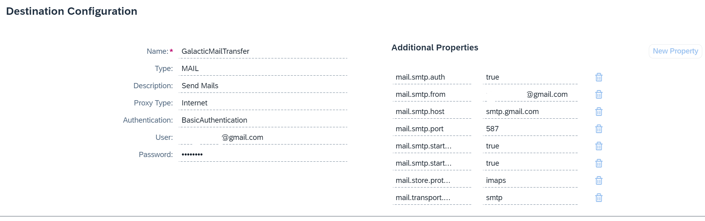
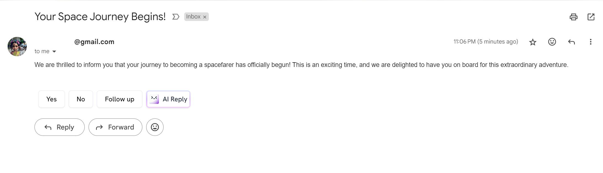

# Getting Started

Step into the extraordinary realm of **Galactic Spacefarer Adventure!** Within this captivating project, we've meticulously crafted an immersive experience to welcome spacefarers on board and provide intricate details about their journey. Delve into the specifics of each spacefarer, including their department, origin planet, positions, and a treasure trove of general information. Embark on this cosmic odyssey where every detail is designed to enhance your exploration of the vast unknown!.

Below, we present the stellar list of entities that form the backbone of our cosmic adventure:

- **[GalacticSpacefarer](./db/data-model.cds)**: Here we have all the General informations about the spacefarer like there name, email, nickName, Origin Planet, Spacesuite color, Image Url etc. Each spacefarer's email serves as a distinctive identifier, ensuring that upon successful onboarding, a personalized and triumphant email is dispatched to their unique address, marking the commencement of their cosmic journey.

- **[Planet](./db/data-model.cds)**: Here we have all the possible planets exist for this project we have considered the below planets.
  - Earth
  - Asgard
  - Xandar
  - Hala
  - Zen-Whoberi
- **[Department](./db/data-model.cds)**: In this entity we have all the Intergalactic Departments listed and based on this we are on-boarding the spacefarers. [Here](./db/data/galactic.spacefarer-Department.csv) we can find teh Department Details.

- **[Position](./db/data-model.cds)**: This entity contains all the Intergalacti positions which we can consider while on-boarding a new spacefarer. Data can be seen [here](./db/data/galactic.spacefarer-Position.csv)

## Validations and Enhancements

Here we have below [validations](./srv/src/controllers/galacticSpacefarerOperations.js)

- The Spacefarer must have more than 100 stardust points to on-board into cosmic journey.
- If they are from Earth and Xandar then they will be getting Bonus 800 stardust points.

## Successful On-Board Action

Once any spacefarer is successfully on-boarded then we are sending a congratulations mail to the respective spacefarer's email. To dispatch an email from a the application, we leveraged the SAP Cloud SDK mail client. In doing so, we established a designated destination within the SAP Business Technology Platform (BTP) account. Through the configured send mail settings, we successfully transmitted the email.

- **Destination**:
  

- **Mail Delivery**:
  

## Authorizations

We have kept two main roles: `PlanetUsers`, `Admin`. Planet users are granted access solely to data related to their affiliated planets and the admin holds the key to the entire cosmic archive, bestowed with the ability to both view and modify all data. Planet users can modify only Stardustcollection and navigation skills.

## Applications

We have two applications:

- [Galactic List Report](./app/galacticlistreport/webapp/index.html): Here we can only access the data and update stardust collections, navigation skills etc. We have leveraged Fiori elements capability to generate teh application
- [Galactic Admin Report](./app/galacticadmin/webapp/index.html): This app is specially for Admin to create spacefarers. And this app built on SAP UI5 Freestyle capabilities.
- Apps can be accessed using the [Dummy User Credentials](package.json).

## Services

In this entire application we have generated two services `GalacticService` and `GalacticAdminService`.

- In the `GalacticService` service the insert, delete capabilities are stopped because we don't want to show the `Create` and `Delete` button to the user in the application. According to the Fiori UI guidelines we should not show the irrelevant data to the user. If we keep only one service then the capabilities will be true for admin and the Planet uesrs will see the Create, Delete button but they are not operational for them. hence we have introduced new service `GalacticAdminService` where we have all the capabilities.
- The service is both V4 and V2 capabilities, because we have used smart controls in Admin app, Smart controls are not yet supported by OData V4 Model. To convert V4 to V2 we have used `@sap/cds-odata-v2-adapter-proxy` dependency and conversion happened in [server.js](./srv/server.js) file.

## Test Cases

We have Listed [all our test cases](./tests/GalacticSpacefarers.http) in the tests folder.
